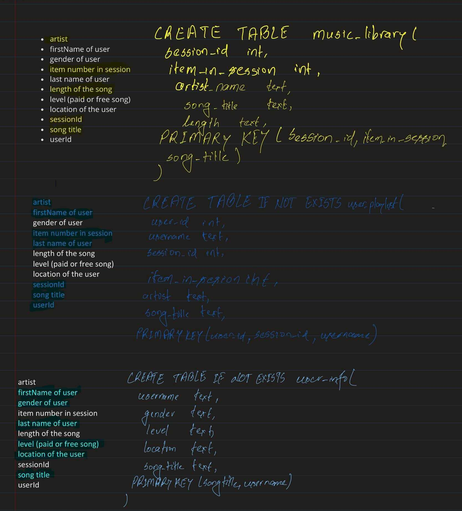

# SONG PLAY ANALYSIS USING APACHE CASSANDRA

## Propose of the database
This database has been designed to answer the following queries
-  Give me the artist, song title and song's length in the music app history that was heard during  sessionId = 338, and itemInSession  = 4
- Give me only the following: name of artist, song (sorted by itemInSession) and user (first and last name) for userid = 10, sessionid = 182
- Give me every user name (first and last) in my music app history who listened to the song 'All Hands Against His Own'

## Tables design to answer the queries

